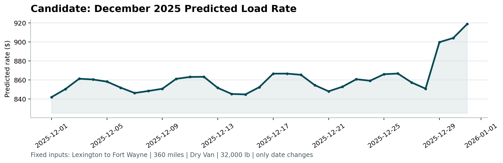

# Freight Rate Prediction Challenge

This repository contains my solution for the Freight Rate Prediction Challenge.

The objective is to predict freight rates for unseen loads using historical shipment, route, market, and temporal information.

## Approach

I used CatBoost regression because the dataset contains a mix of categorical and numerical features.

The workflow included:

1. Data quality checks and preprocessing
2. Date and route feature engineering
3. Time-based validation instead of a random split
4. Rolling validation across multiple months
5. Comparison of RMSE and MAE loss functions
6. Final model training on the full development dataset
7. Prediction of 12,000 unseen loads
8. Prediction of the fixed December 2025 scenario

## Validation Strategy

Since freight rates can change over time, I used chronological validation to better represent how the model would perform on future loads.

Rolling validation was performed across August, September, and October.

| Period | MAE | RMSE | R² |
|---|---:|---:|---:|
| August | $102.61 | $615.53 | 0.83 |
| September | $126.57 | $623.25 | 0.83 |
| October | $112.30 | $645.54 | 0.82 |
| **Average** | **$113.83** | **$628.11** | **0.83** |

The final model uses CatBoost with an MAE objective.

## Feature Engineering

In addition to the original features, I created features related to:

- Route geography
- Date and calendar information
- Weekend behavior
- Distance and market interactions
- Distance and quote-signal interactions
- Missing-value indicators

CatBoost was used to handle the categorical route and equipment features directly.

## December Scenario

The assessment includes a fixed scenario for every day in December 2025:

- Pickup: Lexington
- Delivery: Fort Wayne
- Distance: 360 miles
- Equipment: Dry Van
- Weight: 32,000 lb
- Variable: Date

The generated December prediction chart is shown below.



## Repository Structure

```text
.
├── freight_rate_model.ipynb
├── validation_predictions.csv
├── requirements.txt
├── score.py
├── data/
│   └── december_chart_inputs.csv
└── scorer_results/
    └── candidate_december.png
```

## Installation

Install the required dependencies:

```bash
python -m pip install -r requirements.txt
```

## Run the Scorer

After generating the predictions, run:

```bash
python score.py \
  --predictions validation_predictions.csv \
  --december-predictions data/december_chart_inputs.csv
```

The scorer validates both prediction files and generates:

```text
scorer_results/candidate_december.png
```

Successful validation:

```text
Validated 12,000 final predictions.
Validated 31 fixed December predictions.
Created chart: scorer_results/candidate_december.png
```

Final hidden validation metrics are calculated by Spotter after submission.
